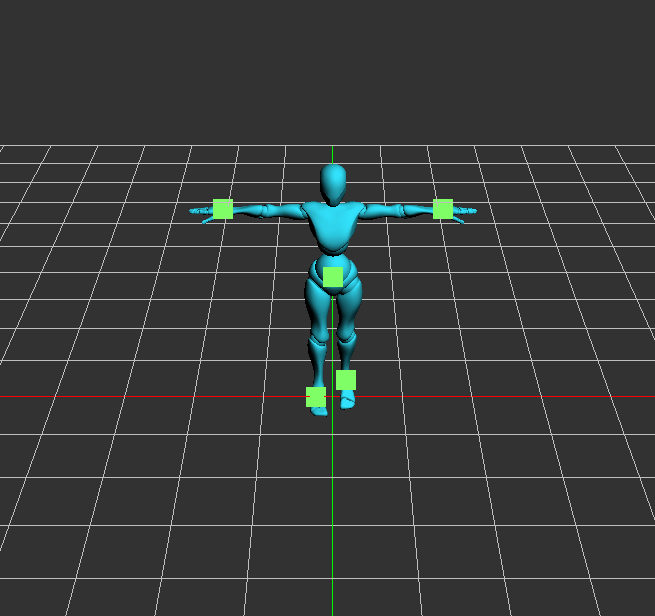

# Curve Editor

##### Different spline (`Cubic Catmul-Rom  `, `Hermite Spline` , `Cubic B-Spline  ` ) computed in different ways(`Bernstein`, `De Casteljau`, `Matrix-based`)

Different spline (`Cubic Catmul-Rom  `, `Hermite Spline` , `Cubic B-Spline  ` ) computed in different ways(`Bernstein`, `De Casteljau`, `Matrix-based`) | Interpolation on Mario
:-: | :-:
<video src='https://user-images.githubusercontent.com/27931931/161395073-332139dc-f441-418c-a95f-8b1cecaa1bf9.mp4' width=180/> | <video src='https://user-images.githubusercontent.com/27931931/161395229-4bfcc690-43c7-41ea-ae3b-4163e12d69b4.mp4' width=180/>

# Bloopers

